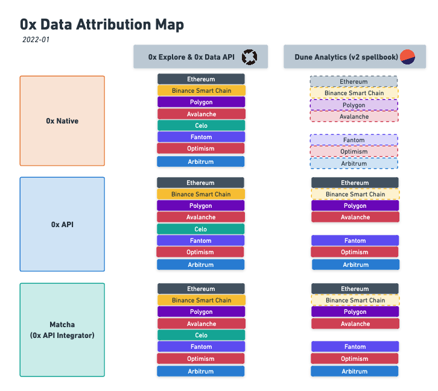

# 📊 How to Get 0x and Matcha Data

\* _updated as of Mar 29, 2023_

This guide introduces the dashboards and tools available to explore 0x data, for different needs. In this piece, we are mainly focusing on ready-made analytics solutions that don’t require advanced data scraping. The following solutions are ideal for teams working on analytics product or data information sites, looking to integrate 0x data with minimum effort; or for DeFi researchers/analysts looking for ready made, reliable sources about the 0x ecosystem. At the end of the document we provide links to resources for advanced use cases.

## 🗺️ Scope and Concepts ✏️

The following resources cover **active** versions of 0x exchange contracts (v2, v3, v4) and API endpoints (v1 `/swap`). Based on the most common use cases, we will introduce how to get data on different layers of the 0x ecosystem, which are defined as follows:

### The DEX Layer - 0x Native

0x Native volume covers orders conforming to one of the 0x Native Order formats (currently two: Limit Order and Rfq Order) and are settled by 0x smart contracts. Orders generated from 0x open order book and RFQ system are settled on them. Besides that, as it’s an open-source onchain infrastructure that any aggregator can use, 1inch exchange and Tokenlon have actively been using the 0x exchange contracts to settle trades. Thus this portion of volume has an overlap with other aggregators’ volume, but no overlap with other AMM DEXes.

### The Aggregator Layer - 0x API (`/swap` endpoint)

0x API is the endpoint that allows any integrator or individual to fetch available quotes from "makers" to match their own "taker" order.

It is an off-chain order matching system that compares prices across:

* On-chain **bridge liquidity** (30+ AMM pools across chain like Uniswap, PancakeSwap, etc.)
* Off-chain **native liquidity** from RFQ system with Professional Market Makers’ quotes
* Off-chain **native liquidity** from 0x’s Open Order Book network (known as mesh, accessed via 0x API `/sra` endpoint)

It returns the best price source (or sources) to users and prepares the routing information to be settled on chain — by 0x exchange contracts (**native liquidity**) or other DEXes' contracts (**bridge liquidity**).

This portion has an overlap with other DEXes' volume as the bridge liquidity will be settled on their origin DEXes, but there’s no overlap with other aggregators.

For a list of all sources, see: [What exchange networks does Matcha aggregate liquidity from?](http://help.matcha.xyz/en/articles/4375069-what-exchange-networks-does-matcha-aggregate-liquidity-from)

### The Application Layer - Matcha and other 0x API Integrators

[Matcha](https://matcha.xyz) is a user-facing product sitting on top of 0x API `/swap` and `/sra` endpoints. It fetches "maker" order via `/swap` endpoints for consumers’ **market orders**; and submit "maker" order via `/sra` endpoints for consumers’ **limit orders** which can later be sourced and potentially filled via `/swap` endpoint. Other integrators work in a similar way, but may include additional sources.

### The Global Total - 0x Protocol

The term 0x Protocol is used to describe the total combined volume covering both 0x DEX layer (0x Native) and aggregator layer (0x API). As we mentioned above, 0x Native liquidity can potentially be "fetched" by 0x API as well, thus there is an overlap between these 2 attributions. We make sure to de-duplicate that part to avoid double counting.

### Summary

Below is a summary table for different attributions:

| Attribution                     | Availability on chains                                        | Layer             | Tag                     | Overlap with DEXes? | Notes                                                                                                                      |
| ------------------------------- | ------------------------------------------------------------- | ----------------- | ----------------------- | ------------------- | -------------------------------------------------------------------------------------------------------------------------- |
| 0x Native                       | Ethereum                                                      | Settlement Layer  | DEX                     | No                  | native volume settled on 0x exchange contracts with fired events including Fill(), rfqOrderFilled() and limitOrderFilled() |
| 0x API                          | Ethereum, BSC, Polygon, Avalanche, Fantom, Celo, Optimism     | Aggregator Layer  | Aggregator              | Yes                 | native + bridge volume going thru 0x API `/swap` endpoint                                                                  |
| 0x API Integrator (e.g. Matcha) | Ethereum, BSC, Polygon, Avalanche, Fantom, Celo, Optimism     | Application Layer | Aggregator (Integrator) | Yes                 | volume Integrator affiliated on top of 0x API `/swap` and `/sra` endpoints                                                 |
| **0x Protocol**                 | **Ethereum, BSC, Polygon, Avalanche, Fantom, Celo, Optimism** | **Global**        | **DEX + Aggregator**    | **Yes**             | **combined total 0x volume with de-duplication of overlap**                                                                |

_Note: 0x Native (native exchange contracts) are deployed on multiple chains outside Ethereum, but not being actively used by any entity at the moment._

## 🧮 Available Data Tools 📎

### 0x Explorer

_For those looking for the easiest way to explore data._

[0x Explorer](https://explorer.0x.org/) offers an easy way to explore all 0x Protocol data across applications and liquidity sources. It gives users a comprehensive view in terms of key metrics like total trade volume, and total users.&#x20;

All application are tagged [here](https://explorer.0x.org/apps).  If you see your application missing on the list, please reach out on 0x Discord in 0x-explorer channel.

### 0x Data API (beta)

_For those looking for an GraphQL API._

0x Explorer provides an API to access all the data available under a public beta, and the document is available [here](https://0x-docs.gitbook.io/data-api/GO2tLD8DYyx4JW6MuM7l/). If you want to get access to this data, please reach out to us through [this](https://www.0x.org/#contact) contact from and select Data API (beta) as your interest.

### 0x Public Dashboards

_For those looking for aggregated data from all chains._

0x Labs uses Metabase as the dashboarding tool and the team constantly opens up public links for ad-hoc data requests from our community. Keep an eye out on our [Twitter](https://twitter.com/0xProject) updates for new dashboards!

* Multi-chain 0x API
  * All Blockchains: [analytics.0x.org](https://analytics.0x.org/)
  * Binance Smart Chain deep dive: [0x API Volume on BSC](https://metabase.spaceship.0x.org/public/dashboard/56cdb892-47bf-4798-ac86-d0d44da5620f)
* 0x API Integrator Deep dive (requires affiliate address input)
  * All Blockchains: [Multichain 0x API Volume w/ Affiliate](https://metabase.spaceship.0x.org/public/dashboard/e79bb86a-6777-4655-88fd-6453fdbefe0f)
  * Ethereum: https://0xtracker.com/apps
  * Binance Smart Chain: [BSC Volume w/ Affiliate](https://metabase.spaceship.0x.org/public/dashboard/1cde2fab-7d96-4021-99e9-07278c2f9543)
  * Polygon: [Polygon Volume w/ Affiliate](https://metabase.spaceship.0x.org/public/dashboard/14293014-fc51-44f8-8388-439475b0e6b1)
  * Avalanche: [Avalanche Volume w/ Affiliate](https://metabase.spaceship.0x.org/public/dashboard/9826ad5c-51e9-438f-92de-eb1672201c1f)
  * Fantom: [Fantom Volume w/ Affiliate](https://metabase.spaceship.0x.org/public/dashboard/9de1a106-7afd-4804-ad80-4ffa2c3ab374?affiliate\_address=0x86003b044f70dac0abc80ac8957305b6370893ed)
  * Celo: [Celo Volume w/ Affiliate](https://metabase.spaceship.0x.org/public/dashboard/b843e324-079f-4548-8919-28fbefdefa6e)
* For Individual Trader (requires a trader address input)
  * [Your 0x API Trade Explorer on BSC](https://metabase.spaceship.0x.org/public/dashboard/0c403d9c-8c58-4594-a9b9-1bfd091b0615)

### Dune Analytics

_For those looking for retrospective data, charts and stats._

If you are just reporting for historic stats, please check out these dashboards:

* [0x Trading Activities](https://www.duneanalytics.com/0x/0x-trading-activity) (covers 0x Protocol, 0x API, 0x Native on Ethereum)
* [Matcha 🍵 ](https://www.duneanalytics.com/0x/matcha)(covers Matcha on Ethereum)
* [0x API and Matcha on Optimism](https://dune.xyz/0x/0x-API-and-Matcha-on-Optimism)

Also comparison with other DEXes & Aggregators on:

* [DEX metrics 📊 ](https://explore.duneanalytics.com/dashboard/dex-metrics)(covers 0x API, 0x Native)
* [Aggregator Market Share 🏦](https://duneanalytics.com/danning.sui/dex-aggregators-by-sui414) (covers 0x API)

If you are looking for stats on specific dates or attribution, you can click into the queries in the above dashboards, to simply fork the queries and change filter for dates or affiliate/relayer in SQL.

### Disclaimer

We constantly work with the teams and maintain our external reporting on platforms mentioned above. Please refer to the list for reliable 0x data decoding. We are actively exploring partnerships with more data services and tools to expand external reporting offerings.

## 🔎 Decode it from Scratch (Advanced) ⛓️

Do you believe that the truth can only be found in the blockchain?

* If you don't have a data pipeline yet - our [event scraper](https://github.com/0xProject/0x-event-pipeline) is open source and only requires an RPC endpoint and a Postgres DB (Contributions are also welcome).
* If you already have a blockchain data ETL already, with the full copy of data processed into relational databases - our [folder](https://github.com/duneanalytics/abstractions/tree/master/ethereum/zeroex) under DuneAnalytics' collaborative repo will be the best reference.

Feel free to reach out to [danning@0xproject.com](mailto:danning@0xproject.com) (@sui414) and [jorge@0xproject.com](mailto:jorge@0xproject.com) (@ktl\_xv) for any questions!

The data must flow. 🧙‍♀️🔮
