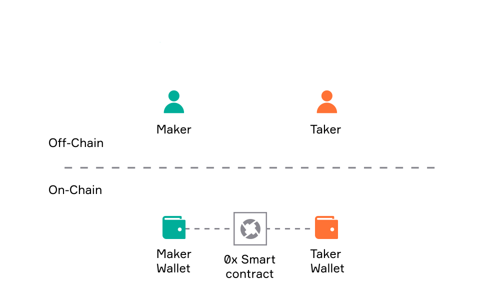

# Introduction to 0x

This documentation describes the public infrastructure we are building - 0x Protocol, API, DAO - to make assets more accessible and liquid and empower teams around the world to build a new financial system. Learn more about [our mission and values](https://0x.org/about/mission).&#x20;


Prefer to watch a video instead? Jump to[ 0x Concept Videos](0x-concept-videos.md).&#x20;


## The 0x Ecosystem&#x20;

0x is an open-source, decentralized exchange infrastructure that enables the exchange of tokenized assets on multiple blockchains.\
\
The 0x protocol is, at its core, a set of secure smart contracts that facilitate the peer-to-peer exchange of [Ethereum](https://ethereum.org/en/)-based assets. The protocol serves as an open standard and common building block for any developer needing exchange functionality. \
\
In addition to the externally-audited smart contracts, 0x also offers developer tools tailored to the ecosystem and open-access to a pool of shared liquidity.

Developers can integrate with 0x at the smart contract or application layer.\
\
The diagram below shows an overview of the 0x ecosystem, which includes applications who provide liquidity (supply), applications who consume liquidity (demand), and the multiple supported blockchains.&#x20;

### Makers and Takers

Within the 0x ecosystem, there are two sides - Makers and Takers:&#x20;

#### **Supply (aka Makers)**

This is the entity who creates 0x orders and _provides liquidity_ into the system for the Demand side (Takers) to consume. 0x aggregates liquidity from multiple sources including:

* On-chain liquidity - DEXs, AMMs (e.g. Uniswap, Curve, Bancor)
* Off-chain liquidity - Professional Market Makers, 0x's Open Orderbook network
* _Relevant Docs:_
  * [Broken link](broken-reference "mention") _-_ Professional Market Making With Limit Orders
  * [Broken link](broken-reference "mention") _-_ Sharing Limit Orders
  * [Broken link](broken-reference "mention") _-_ Filling and Managing Limit Orders

#### **Demand (aka Takers)**

This is the entity who wants the Maker's asset. The Takers agree to trade their asset for the Maker's asset; in other words, they _consume the 0x liquidity_. Examples include projects such as MetaMask, Coinbase, and dydx.

* _Relevant Docs:_
  * [Broken link](broken-reference "mention") - Programatically execute a ERC20 token trade
  * [Broken link](broken-reference "mention") - NFT Limit Orders (ERC721 + ERC1155)

### **Governance**

In addition to Makers and Takers is the 0x Community DAO, which is the collective governing voice of the 0x protocol and the ZRX token.&#x20;

* _Relevant Docs:_&#x20;
  * [Broken link](broken-reference "mention")

## 0x Protocol, API, and DApps

#### **0x Protocol**

At the core of 0x is the [0x Protocol](https://github.com/0xProject/protocol), a set of audited smart contracts that are deployed on Ethereum and 6 other EVM chains and L2 networks (as of Feb 2022). These smart contracts enable the trading of [ERC20](https://ethereum.org/en/developers/docs/standards/tokens/erc-20/), [ERC721](https://eips.ethereum.org/EIPS/eip-721), and [ERC1155](https://eips.ethereum.org/EIPS/eip-1155) assets.

#### **0x API**

The [0x API](https://github.com/0xProject/0x-api) is the interface that allows DeFi developers to tap into the 0x Protocol and trade ERC20 assets. It has 2 major endpoints -[ /swap](broken-reference) and [/orderbook](broken-reference). \
The [/swap endpoint ](broken-reference)allows users to fetch available quotes across the liquidity supply. The API aggregates liquidity from on-chain and off-chain networks and uses [smart order routing ](https://blog.0xproject.com/0x-apis-smart-order-routing-7af0195515e5)to split up a transaction across decentralized exchange networks to be filled with the lowest slippage possible while minimizing transaction costs. \
The[ /orderbook endpoint](broken-reference) lets applications and users access 0x's open orderbook liquidity, and post limit orders making them publicly available immediately. Orderbook API replaces the 'SRA' API, without introducing breaking changes as all endpoints are backward compatible.\
\
**NFT Swap SDK**

The [NFT Swap SDK](https://github.com/trader-xyz/nft-swap-sdk) was built and maintained by [Trader.xyz](https://trader.xyz/), an ecosystem partner. It is a  library written in Typescript that allows developers to quickly integrate NFT swap functionality into their app. It leverages the [NFT features in the 0x protocol v4](broken-reference) to swap ERC20, ERC721, and ERC1155 assets.&#x20;

#### **Applications**

Applications, which includes both Makers and Takers, integrate with the 0x API or NFT Swap SDK or directly access the protocol’s smart contracts to take action on the best prices.

## How does 0x work?

Let’s look into how a 0x order is executed.

1. A Maker creates a 0x order which is a json object that adheres to a standard order message format (see list of all [0x order types here](0x-cheat-sheet.md#0x-order-types)). It indicates what kind of asset the Maker is committed to trade. Assets could include fungible tokens (ERC20), non-fungible tokens (ERC721), or bundles of assets (ERC1155).
2. The order is hashed, and the Maker signs the order to cryptographically commit to the order they authored.
3. The order is shared with counter-parties.
   * If the Maker of the 0x order already knows their desired counter-party, they can send the order directly (via email, chat, or over-the-counter platform)
   * If the Maker doesn’t know a counter-party willing to take the trade, they can submit the order to orderbook.&#x20;
4. 0x API aggregates liquidity across all the [sources](introduction-to-0x.md#supply-aka-makers) to surface the best price for the order to the Taker. 0x helps traders create, find, and fill the 0x orders through the paradigm of [_off-chain relay and on-chain settlement_](../developer-resources/glossary.md#off-chain-relay-on-chain-settlement). This means that 0x does not store orders on the blockchain; instead, orders are stored off-chain, and trade settlement only occurs on-chain. This unique feature makes 0x a flexible and gas-efficient DEX protocol for developers to build on.
5. The Taker fills the 0x order by submitting the order and the amount they will fill it for to the blockchain.
6. The 0x protocol’s settlement logic verifies the Maker’s digital signature and that all the conditions of the trade are satisfied. If so, the assets involved are [atomically swapped](../developer-resources/glossary.md#atomically-swapped) between Maker and Taker. If not, the trade is reverted.

## What can I build on 0x?

0x is an open-source project, which opens it up for anyone to freely use it as a liquidity lego in their product.

Projects can be built on 0x. In addition, 0x can also be integrated into any existing application where exchange is not the core purpose of the application. Below are some project ideas. For more examples, see **The "comprehensive" list of projects** section in [this article](https://blog.0xproject.com/exploring-the-0x-defi-ecosystem-3afe70379be0).

### Demand (Takers)

* Exchanges
  * A decentralized exchange for X asset on Y market
  * An Ebay-style marketplace for digital goods
  * An over-the-counter (OTC) trading desk
* Wallets
  * Digital wallets whose users want to exchange tokens
* Options and derivatives
  * A DeFi protocol that needs liquidity and exchange to function (e.g. a derivatives, lending, or options protocol)
* Portfolio managers
* Prediction markets
* Non-fungible tokens (NFT)
  * NFT marketplace
  * Games with in-game currencies or items
* Investment strategies (e.g. DeFi index funds, DCA apps)
* Data
  * 0x multi-chain analytics portal
  * Real-time trades panel w/ GraphQL wrappers

### Supply (Makers)

* Orderbook models
* Automatic Market Makers (AMM) models
* Market Makers
  * A market making or arbitrage trading bot
