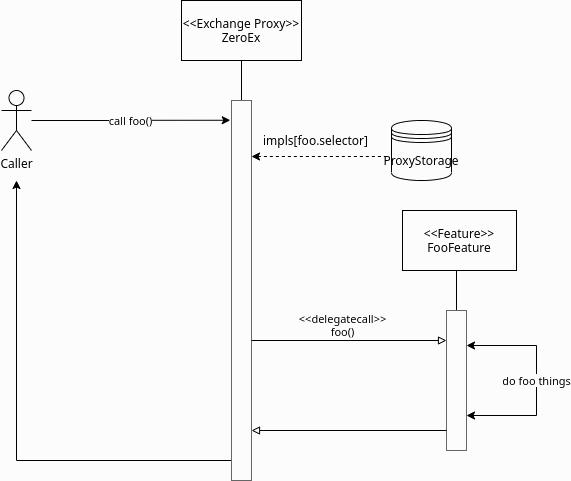

# Exchange Proxy

The Exchange Proxy (also just called the EP, `ZeroEx`, or Exchange V4) is the main contract makers and takers interact with for managing the process of and performing the exchange of assets on the 0x Protocol. The most commonly used functionalities this contract exposes are:

* Executing swaps generated by 0x API.
* Managing and filling ERC20 limit orders.
* Managing and filling ERC20<->ERC721/ERC1155 limit orders.

All direct interactions with the 0x Protocol go through the Exchange Proxy contract. Check the [0x-cheat-sheet.md](../../../introduction/0x-cheat-sheet.md "mention") for the appropriate address for your network.

### Architecture

Under the hood, the Exchange Proxy contract (`ZeroEx`) is a type of proxy contract, meaning that this contract itself has very little functionality inside of it. Its main responsibility is to maintain a mapping of function selectors to implementation contracts. When it receives a function call, it looks up the appropriate implementation contract for the function being called (identified by its leading 4-byte selector) and forwards the call to it using `delegatecall` semantics. As such, each function's implementation can reside in a completely different contract. We call these implementation contracts [features](features/ "mention"), which can be registered and deregistered as needed.

