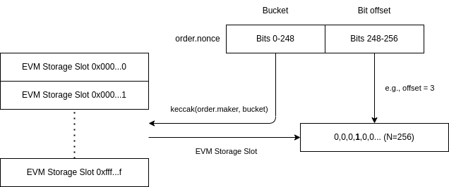

# ERC1155Orders


This feature implements the ERC1155<->ERC20/ETH limit order type. The source code for [ERC1155OrdersFeature.sol](https://github.com/0xProject/protocol/blob/c1177416f50c2465ee030dacc14ff996eebd4e74/contracts/zero-ex/contracts/src/features/nft\_orders/ERC1155OrdersFeature.sol) can be found [here](https://github.com/0xProject/protocol/blob/c1177416f50c2465ee030dacc14ff996eebd4e74/contracts/zero-ex/contracts/src/features/nft\_orders/ERC1155OrdersFeature.sol).  \
\
\
Here are some highlights:

* Limit orders in the 0x protocol are off-chain messages that define a fixed-rate trade signed by a "maker" and filled on-chain by a "taker."
* The protocol is non-custodial in that neither party needs to deposit assets into the protocol in advance. Instead, _both parties must first_ [_grant the protocol_ ](../../../../introduction/0x-cheat-sheet.md)_an ERC20/ERC115 allowance for the assets they intend to sell_, and the protocol will spend this allowance during settlement.
* Due to the non-custodial nature of the protocol, the raw native asset (e.g., ETH) is only supported as a taker or fee token. Makers must use a wrapped variant (e.g., WETH) if trying to sell the network's native asset.
* Unlike ERC721 limit orders, ERC1155 limit orders have a quantity of the ERC1155 token being traded. These orders can be fully filled once or partially filled repeatedly until all quantities in the order have been exhausted.
* Once a limit order is signed, anyone with the order and signature details can fill the order (unless the order restricts the `taker` address). There is no way to un-sign an order so cancellations must be performed on-chain before a taker attempts to fill it.
* An NFT order can be made for a ERC1155 token with an unknown ID (see [ERC1155 Buy Orders](erc1155orders.md#erc721-buy-orders)).

### The ERC1155 Limit Order Struct

```solidity
struct ERC1155Order {
    TradeDirection direction;
    address maker;
    address taker;
    uint256 expiry;
    uint256 nonce;
    address erc20Token;
    uint256 erc20TokenAmount;
    Fee[] fees;
    address erc1155Token;
    uint256 erc1155TokenId;
    Property[] erc1155TokenProperties;
    uint128 erc1155TokenAmount;
}
```

* `direction`: Whether this order is selling an NFT or buying an NFT (see [#erc1155-sell-orders](erc1155orders.md#erc1155-sell-orders "mention") or [#undefined](erc1155orders.md#undefined "mention")).
* `maker`: The maker/signer of this limit order.
* `taker`: Who can fill this order. May be NULL (`0x000...`) to allow anyone.
* `expiry`: The block timestamp at which this trade is no longer valid.
* `nonce`: Usually a random nonce the maker sets to ensure the hash of this order is unique and to identify it during fills and cancellations. Carefully choosing this value can be used to reduce gas usage during cancellations (see [#smart-nonces](erc1155orders.md#smart-nonces "mention")).
* `erc20Token`: The ERC20 token (or native asset, if allowed) to exchange for the NFT. For eligible trades, the native asset may be specified as `0xeee...`.
* `erc20TokenAmount`: The amount of `erc20Token` to exchange for the NFT.
* `fees`: Optional fees, denominated in `erc20Token`, that are paid out to designated recipients when the order is filled. Fees are collected _in addition_ to the `erc20TokenAmount`.
* `erc1155Token`: The NFT's ERC1155 token contract address being exchanged.
* `erc1155TokenId`: The ID of the ERC1155 token inside `erc1155Token` being exchanged. This will be ignored for [buy orders](erc1155orders.md#erc721-buy-orders) with valid `erc1155TokenProperties`.
* `erc1155TokenProperties`: A series of contracts that will be called to validate an unknown NFT token ID being bought at settlement.
* `erc1155TokenAmount`: The maximum total quantity of `erc1155TokenId` being traded.&#x20;

Where `TradeDirection` is:

```solidity
enum TradeDirection {
    SELL_NFT,
    BUY_NFT
}
```

`Fee` is:

```solidity
struct Fee {
    address recipient;
    uint256 amount;
    bytes feeData;
}
```

`Property` is:

```solidity
struct Property {
    address propertyValidator;
    bytes propertyData;
}
```

### Order Hashes

The protocol utilizes a canonical, [EIP712](https://eips.ethereum.org/EIPS/eip-712) hash of the limit order struct to verify the authenticity of the order. In typical usage, this is the hash that the maker signs to make the order valid and fillable.

Computing the hash of a limit order in solidity is given by:

```solidity
bytes32[] memory feesStructHashArray = new bytes32[](order.fees.length);
for (uint256 i = 0; i < order.fees.length; ++i) {
    feesStructHashArray[i] = keccak256(abi.encode(
        bytes32(0xe68c29f1b4e8cce0bbcac76eb1334bdc1dc1f293a517c90e9e532340e1e94115),
        order.fees[i].recipient,
        order.fees[i].amount,
        keccak256(order.fees[i].feeData)
    ));
}
bytes32 memory feesHash = keccak256(abi.encodePacked(
    feesStructHashArray
));
bytes32[] memory propertiesStructHashArray = new bytes32[](order.erc11155TokenProperties.length);
for (uint256 i = 0; i < order.erc1155TokenProperties.length; ++i) {
    propertiesStructHashArray[i] = keccak256(abi.encode(
        bytes32(0x6292cf854241cb36887e639065eca63b3af9f7f70270cebeda4c29b6d3bc65e8),
        order.erc1155TokenProperties[i].propertyValidator,
        keccak256(order.erc1155TokenProperties[i].propertyData)
    ));
}
bytes32 memory propertiesHash = keccak256(abi.encodePacked(
    propertiesStructHashArray
));
keccak256(abi.encode(
    bytes32(0x930490b1bcedd2e5139e22c761fafd52e533960197c2283f3922c7fd8c880be9),
    order.direction,
    order.maker,
    order.taker,
    order.expiry,
    order.nonce,
    order.erc20Token,
    order.erc20TokenAmount,
    kecca256(abi,
    order.erc1155Token,
    order.erc1155TokenId,
    propertiesHash,
    order.erc1155TokenAmount
));
```

Another way to get the hash of an order is to simply call `getERC1155OrderHash()` on the [Exchange Proxy](../).

### Signatures

To fill an order, the taker must (usually, see below) also submit an ECDSA signature generated for that order, typically signed by the maker. For information on the format an how to generate these signatures, see [signatures.md](../../signatures.md "mention").

### Smart Contract Makers

Smart contracts do not have a private key associated with them so they cannot generate a valid ECDSA signature. Yet they still can operate as the `maker` of an order. To do this, they must call `preSignERC1155Order()`, which will allow the order to be filled using the `PRESIGNED` `signatureType`.

### Network Discoverable Orders

Another feature of the `preSignERC1155Order()` function is that it will emit an event `ERC1155OrderPreSigned` (see [#events](erc1155orders.md#events "mention")) listing all the details of the order. Anyone can listen for these events and potentially fill the order without relying on off-chain sharing mechanisms.

### Smart Nonces

The `nonce` field in the order is a number the maker chooses to ensure uniqueness of the order, but it also one other function:

* To identify the order (in addition to the caller/maker) in cancellation functions (see [#maker-functions](erc1155orders.md#maker-functions "mention")). This can make cancellations more efficient.

#### Gas Optimized Nonces

The protocol marks ERC1155 orders as cancelled by setting a bit in a 256-bit word (cancellation bit vector) indexed by the order maker and upper 248 bits of the order's nonce. The lower 8 bits of the nonce determine which bit in the cancellation bit vector corresponds to that order.&#x20;



This allows for much cheaper cancellation for up to 256 simultaneous orders. To take advantage of this gas optimization, makers should reuse the upper 248 bits of their nonce across up to 256 different orders, varying the value of the lower 8 bits between them.

### ERC1155 Sell Orders

Sell orders are orders where `direction` is set to `TradeDirection.SELL_NFT`, which indicates that a _maker wishes to **sell** an ERC1155 token that they possess_.

For these orders, the maker must set the `erc1155Token` and `erc1155TokenId` fields to the ERC1155 token contract address  and the ID of the  ERC1155 token they're trying to sell, respectively. The `erc20Token` and `erc20TokenAmount` fields will be set to the ERC20 token and the ERC20 amount they wish to receive for their NFT.

### ERC1155 Buy Orders

Buy orders are where `direction` is set to `TradeDirection.BUY_NFT`, which indicates that a _maker wishes to **buy** an ERC1155 token that they do not possess_.

A buy order can be created for a known token ID or an unknown token ID.

#### Buying a Known NFT Token ID

This is when the maker knows exactly which NFT they want, down to the token ID. These are fairly straight-forward and just require the maker setting the `erc1155Token` and `erc1155TokenId` fields to the ERC1155 token contract address and the ID of the token they want to buy, respectively. The The `erc20Token` and `erc20TokenAmount` fields will be set to the ERC20 token and the ERC20 amount they are willing to pay for that particular NFT. The `erc1155TokenProperties` field should be set to the empty array.

#### Buying an Unknown NFT Token ID

This is when the maker will accept any token ID from an ERC1155 contract. In this scenario, the `erc1155TokenProperties` order field is used to signal and validate terms of this kind of order.

If a maker wishes to accept any token ID, regardless of any other properties of that NFT, they should set the `erc1155TokenProperties` field to an array with exactly one item in it:

```solidity
[
    Property({
        propertyValidator: address(0),
        propertyData: ""
    })
]
```

If a maker wishes to accept any token ID, but only if that token also satisfies some other properties (e.g., cryptokitty with green eyes), they should set `erc1155TokenProperties` to an array of callable property validator contracts. Each `propertyValidator` contract must implement the `IPropertyValidator` interface, which is defined as:

```solidity
interface IPropertyValidator {
    function validateProperty(
        address tokenAddress,
        uint256 tokenId,
        bytes calldata propertyData
    )
        external
        view;
}

```

Each entry in `erc1155TokenProperties` with a non-null `propertyValidator` address will be called using this interface, passing in the `tokenAddress` and `tokenId` of the ERC1155 the taker is trying to fill the order with. If the validator fails to validate the requested properties of the NFT, it should revert.

The `propertyData` field of each property entry is supplied by the maker and is also passed in.  For example, if a property validator contract was designed to check that a cryptokitty had a specific eye color, the `propertyData` could simply be some encoding of `"green"`, and the validator contract would parse this data and perform the necessary checks on the token to ensure it has green eyes.

### Taker Callbacks

Some fill functions accept a `callbackData` `bytes` parameter. If this parameter is non-empty (`length > 0`), a call will be issued against the caller using `callbackData` as the full call data. This call happens after the transfer of the maker asset and before the transfer of the taker asset. This allows a smart contract taker to leverage the maker's asset to fulfill their end of the trade. For example, if a taker finds a compatible, complementary order on another protocol they could fulfill that order with the maker's asset, supply the Exchange Proxy with the necessary opposing asset with the proceeds, and pocket the difference.

### Information Functions (read-only)

* **`validateERC1155OrderSignature(ERC1155Order order, Signature signature)`**
  * Check if `signature` is valid for `order`. Reverts if not.&#x20;
* **`validateERC1155OrderProperties(ERC1155Order order, uint256 erc1155TokenId)`**
  * Validates that a given `erc1155TokenId` satisfies a _buy_ order.
  * For orders with a known token ID, verifies that they match.
  * For orders with an unknown token ID, checks that all property validators succeed for the token.
  * Reverts if `erc1155TokenId` does not satisfy the buy order.
* **`getERC1155OrderInfo(ERC1155Order order) returns (OrderInfo orderInfo)`**
  * Retrieve information on an ERC1155 order. See [#orderinfo](erc1155orders.md#orderinfo "mention") for more details.
* **`getERC1155OrderHash`(`ERC1155Order orde`) returns (bytes32 orderHash)**
  * Compute the canonical hash of an `ERC1155` order. See [#order-hashes](erc1155orders.md#order-hashes "mention").

### Maker Functions

* **`preSignERC1155Order(ERC1155Order order)`**
  * If called by `order.maker`, marks the order as presigned, which means takers can simply pass in an empty signature with `signatureType = PRESIGNED`.
  * Must be called by the `order.maker`.
  * This can also be used to publish/broadcast orders on-chain, as it will emit an `ERC1155OrderPreSigned` event.
* **`cancelERC1155Order(uint256 orderNonce)`**
  * Cancels any order with `nonce == orderNonce` and where the `maker` is the caller.
* **`batchCancelERC1155Orders(uint256[] orderNonces)`**
  * Batch version of `cancelERC1155Order()`.

### Taker/Fill Functions

* **`sellERC1155(ERC1155Order buyOrder, Signature signature, uint256 erc1155TokenId, uint256 erc1155SellAmount,bool unwrapNativeToken, bytes callbackData)`**
  * Sell `erc1155SellAmount` amount of ERC1155 token `erc1155TokenId` to a `buyOrder`.
  * The `signature` must be a valid signature for `buyOrder` generated by `buyOrder.maker`.
  * If `unwrapNativeToken` is `true` and the `erc20Token` of the order is a wrapped version of the native token (e.g., WETH), this will also unwrap and transfer the native token to the taker.
  * If `callbackData` is non-empty, the taker (`msg.sender`) will be called using this `callbackData` as call data. This happens after `erc20Token` is transferred to the taker, but before `erc1155SellAmount` of `erc1155TokenId` is transferred to the maker.
* **`buyERC1155(ERC1155Order sellOrder, uint128 erc1155BuyAmount, Signature signature, bytes callbackData) payable`**
  * Buy `erc1155BuyAmount` quantity of an ERC1155 token being sold by `sellOrder`.
  * The `signature` must be a valid signature for `sellOrder` generated by `sellOrder.maker`.
  * If the order's `erc20Token` is the the native token (`0xeee...`), the native token (ETH on Ethereum) must be attached to the function call.&#x20;
  * If `callbackData` is non-empty, the taker (`msg.sender`) will be called using this `callbackData` as call data. This happens after `erc1155BuyAmount` of ERC1155 token is transferred to the taker, but before `erc20Token` is transferred to the maker.
* **`batchBuyERC1155s(ERC1155Order[] sellOrders, uint128[] ercc1155BuyAmounts, Signature[] signatures, bytes[] callbackData, bool revertIfIncomplete) payable returns (bool[] successes)`**
  * Batch version of `buyERC1155()`.
  * If `revertIfIncomplete` is true, reverts if any of the individual buys fail.
  * If `revertIfIncomplete` is `false`, returns an array of which respective fill succeeded.

### OrderInfo

`getERC1155OrderInfo()` returns a structure defined as:

```solidity
struct OrderInfo {
  bytes32 orderHash;
  OrderStatus status;
  uint128 orderAmount;
  uint128 remainingAmount;
}
```

Each field

* `orderHash` - The canonical hash of the order (see [#order-hashes](erc1155orders.md#order-hashes "mention")).
* `status`: One of `INVALID: 0`, `FILLABLE: 1`, `UNFILLABLE: 2`, `EXPIRED: 3`.
* `orderAmount`: Equal to `order.erc1155TokenAmount`.
* `remainingAmount`: The portion of `orderAmount` that has yet to be filled.

### Events

```solidity
/// @dev Emitted whenever an `ERC1155Order` is filled.
/// @param direction Whether the order is selling or
///        buying the ERC1155 token.
/// @param maker The maker of the order.
/// @param taker The taker of the order.
/// @param nonce The unique maker nonce in the order.
/// @param erc20Token The address of the ERC20 token.
/// @param erc20FillAmount The amount of ERC20 token filled.
/// @param erc1155Token The address of the ERC1155 token.
/// @param erc1155TokenId The ID of the ERC1155 asset.
/// @param erc1155FillAmount The amount of ERC1155 asset filled.
/// @param matcher Currently unused.
event ERC1155OrderFilled(
    LibNFTOrder.TradeDirection direction,
    address maker,
    address taker,
    uint256 nonce,
    IERC20TokenV06 erc20Token,
    uint256 erc20FillAmount,
    IERC1155Token erc1155Token,
    uint256 erc1155TokenId,
    uint128 erc1155FillAmount,
    address matcher
);

/// @dev Emitted whenever an `ERC1155Order` is cancelled.
/// @param maker The maker of the order.
/// @param nonce The nonce of the order that was cancelled.
event ERC1155OrderCancelled(
    address maker,
    uint256 nonce
);

/// @dev Emitted when an `ERC1155Order` is pre-signed.
///      Contains all the fields of the order.
event ERC1155OrderPreSigned(
    LibNFTOrder.TradeDirection direction,
    address maker,
    address taker,
    uint256 expiry,
    uint256 nonce,
    IERC20TokenV06 erc20Token,
    uint256 erc20TokenAmount,
    LibNFTOrder.Fee[] fees,
    IERC1155Token erc1155Token,
    uint256 erc1155TokenId,
    LibNFTOrder.Property[] erc1155TokenProperties,
    uint128 erc1155TokenAmount
);
```
